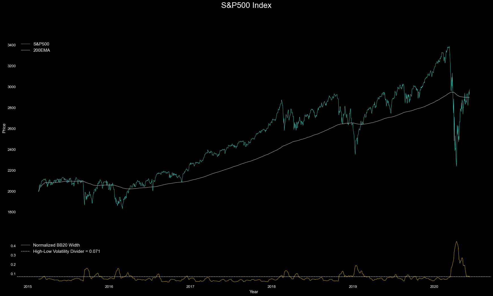
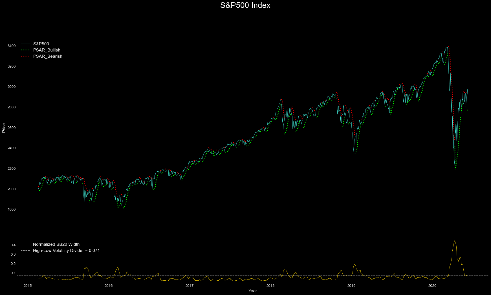

# S&P 500 Volatility-Adaptive Trading Bot

A rule-based algorithmic trading strategy that dynamically switches between trend-following and mean-reversion regimes based on real-time volatility. Backtested on 5 years of S&P 500 data, the strategy achieved **20.54% CAGR** and a **0.93 Sharpe ratio** — outperforming buy-and-hold (8.26% CAGR, 0.59 Sharpe) while significantly reducing drawdowns during the Feb–Mar 2020 crash.

## Tech Stack

| Layer | Technology |
|-------|-----------|
| Language | Python 3 |
| Data | yfinance (Yahoo Finance API) |
| Analysis | pandas, NumPy |
| Visualization | matplotlib |
| Indicators | Parabolic SAR, Bollinger Band Width, 200 EMA (implemented from scratch) |

## Core Idea



The S&P 500 behaves differently in **low-volatility** vs **high-volatility** regimes:

- **Low volatility** (BB-Width < 0.071): The index trends upward, supported by the 200 EMA. PSAR signals are noisy and unreliable — better to ride the bullish trend.
- **High volatility** (BB-Width >= 0.071): PSAR trend reversals become accurate and prolonged. Switching to PSAR-driven Long/Short positioning protects against — and profits from — sharp price swings.

The threshold of **0.071** was determined through repeated backtesting as the optimal volatility divider.

## Algorithm



```
IF BB-Width < 0.071 (Low Volatility):
    Default: LONG (ride bullish trend)
    Exception: SHORT only when Day Lows drop faster than Day Highs

IF BB-Width >= 0.071 (High Volatility):
    PSAR trend = Up  → LONG
    PSAR trend = Down → SHORT
```

The strategy uses three technical indicators in combination:

| Indicator | Role |
|-----------|------|
| **Bollinger Band Width** | Volatility regime detector — decides which sub-strategy to activate |
| **Parabolic SAR** | Trend reversal signal — drives Long/Short decisions during high volatility |
| **200 EMA** | Macro trend filter — confirms overall S&P 500 direction |

## Backtest Results (2015–2020)


| Metric | S&P 500 (^GSPC) | SPY ETF | Algorithm |
|--------|:-------:|:-------:|:---------:|
| **CAGR** | 8.26% | 9.05% | **20.54%** |
| **Sharpe Ratio** | — | 0.59 | **0.93** |

During the Feb–Mar 2020 crash, the algorithm's cumulative returns **surged** while the S&P 500 declined 30%+ — demonstrating the strategy's core value: protecting against and profiting from volatility spikes.

Data sources: [Morningstar](https://www.morningstar.com/etfs/arcx/spy/performance), [DQYDJ](https://dqydj.com/sp-500-return-calculator/)

## Project Structure

```
├── Improved SP500 Strat.py             # Full strategy: data ingestion, indicators, backtesting, visualization
├── functions/
│   ├── PSAR_200EMA_BB.py               # Reusable indicator implementations (PSAR, Bollinger Bands)
│   └── Price Retrieval_KPI_Misc Functions.py  # OHLC retrieval, CAGR, Sharpe, max drawdown
├── image/                              # Backtest visualizations
│   ├── 200EMA_BB.png
│   ├── PSAR_BB.png
│   └── s&p500_vs_cumul_ret.png
└── LICENSE
```

## Getting Started

```bash
pip install yfinance pandas numpy matplotlib
python "Improved SP500 Strat.py"
```

The script fetches 5+ years of S&P 500 daily OHLC data from Yahoo Finance, computes all indicators, runs the backtest, and generates performance charts.

## Disclaimer

This is a backtesting study for educational purposes. Past performance does not guarantee future results. Not financial advice.
